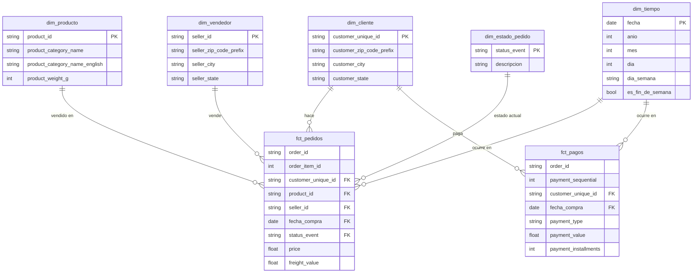

# Contratos de datos — Bronze / Silver / Gold

> Fase 1. Documento de diseño, cerrado antes de escribir código de
> transformación (principio rector #1 de `docs/decisions/plan-fases.md`).
> Decisiones de arquitectura no triviales referenciadas están en
> `docs/decisions/` (ADRs 0001-0004; stack y almacenamiento en 0005-0009;
> implementación física de Bronze en 0010-0015; diseño de Silver en
> 0017-0025).

## Convenciones generales

- **Tipos**: se listan en términos conceptuales (`string`, `int`, `float`,
  `date`, `datetime`, `bool`); el tipo exacto de Polars/Pandera se fija al
  implementar (Fase 2/3).
- **Columnas de linaje** (todas las tablas Bronze): `dia_simulado` (date —
  partición), `ingested_at` (datetime — cuándo corrió la ingesta real),
  `source_file` (string), `batch_hash` (string — hash del contenido del
  batch, para detectar reprocesos idénticos).
- **Nomenclatura**: `bronze_<tabla>`, `silver_<tabla>`, `dim_*`/`fct_*` en
  Gold (según el plan).

---

## 1. Estrategia de replay cronológico (resumen)

Diseño completo en el ADR 0004. Resumen operativo:

| Tabla fuente | Ancla temporal | Re-emisión en Bronze |
| --- | --- | --- |
| `orders` | `order_purchase_timestamp`, `order_approved_at`, `order_delivered_carrier_date`, `order_delivered_customer_date` | Una fila cruda por cada timestamp no nulo, en el día simulado correspondiente |
| `order_reviews` | `review_creation_date` | Una fila, en su propio día |
| `order_items`, `order_payments` | (ninguno propio) | Una sola vez, junto al día de `order_purchase_timestamp` del pedido padre |
| `customers`, `products`, `sellers`, `geolocation`, `category_translation` | (sin dimensión temporal en la fuente) | Snapshot completo, no particionado por día |

`order_purchase_timestamp` es el ancla porque es el único timestamp de
`orders` sin nulos en el 100% de los pedidos (confirmado en la exploración
de Fase 0) — todo pedido tiene garantizado un "día de llegada" inicial.

---

## 2. Capa Bronze

### `bronze_orders`

Copia cruda de `orders.csv`, re-emitida por evento (ADR 0004).

| Columna | Tipo | Nullable | Notas |
| --- | --- | --- | --- |
| `order_id` | string | no | |
| `customer_id` | string | no | FK per-pedido, no es la persona real (ver `dim_cliente`) |
| `order_status` | string | no | valor final conocido del pedido, tal cual la fuente |
| `order_purchase_timestamp` | datetime | no | |
| `order_approved_at` | datetime | sí | nulo válido si el pedido no llegó a esa etapa |
| `order_delivered_carrier_date` | datetime | sí | ídem |
| `order_delivered_customer_date` | datetime | sí | ídem |
| `order_estimated_delivery_date` | datetime | no | |

**Grano:** `(order_id, dia_simulado)` — no `order_id` solo, porque un
mismo pedido puede re-emitirse en varios días.

### `bronze_order_items`

Copia cruda de `order_items.csv`. Grano: `(order_id, order_item_id)`.
Columnas: `order_id`, `order_item_id` (int), `product_id`, `seller_id`,
`shipping_limit_date` (datetime), `price` (float), `freight_value` (float)
— ninguna nullable.

### `bronze_order_payments`

Copia cruda de `order_payments.csv`. Grano: `(order_id, payment_sequential)`.
Columnas: `order_id`, `payment_sequential` (int), `payment_type` (string),
`payment_installments` (int), `payment_value` (float) — ninguna nullable.

### `bronze_order_reviews`

Copia cruda de `order_reviews.csv`. Grano `(review_id, order_id)`: un
mismo `review_id` puede aparecer asociado a varios pedidos (ADR 0021).
Columnas: `review_id`, `order_id`, `review_score` (int),
`review_comment_title` (string, nullable), `review_comment_message`
(string, nullable), `review_creation_date` (datetime),
`review_answer_timestamp` (datetime).

### Tablas de referencia (`bronze_customers`, `bronze_products`, `bronze_sellers`, `bronze_geolocation`, `bronze_category_translation`)

Copia cruda 1:1 de sus CSVs fuente, snapshot completo (sin partición por
día). Columnas = columnas originales del CSV (ver
`notebooks/01_exploracion_olist.ipynb`, sección 1, para el schema exacto
inferido de cada una).

### Implementación física de Bronze (Fase 2)

**Tipos:** todas las columnas fuente se persisten como texto; solo las
columnas de linaje van tipadas (ADR 0011). Los tipos listados arriba son
los que Silver debe poder convertir, no los físicos de Bronze.

**Layout** (relativo a la raíz de almacenamiento configurable, ADR 0008):

```text
bronze/
├── _staging/                      ← temporales de escritura (ADR 0015)
├── orders/dia_simulado=YYYY-MM-DD/part-0.parquet
├── order_items/dia_simulado=YYYY-MM-DD/part-0.parquet
├── order_payments/dia_simulado=YYYY-MM-DD/part-0.parquet
├── order_reviews/dia_simulado=YYYY-MM-DD/part-0.parquet
├── customers/snapshot.parquet
├── products/snapshot.parquet
├── sellers/snapshot.parquet
├── geolocation/snapshot.parquet
└── category_translation/snapshot.parquet
```

El nombre de la tabla en disco omite el prefijo `bronze_` (lo da la
carpeta de la capa). Particionado estilo Hive: Polars, DuckDB y dbt
reconstruyen `dia_simulado` a partir de la ruta, así que en las tablas de
eventos **no se guarda dentro del archivo**; en los snapshots sí va como
columna y significa "día en que se escribió el contenido actual" (ADR
0015). Un día sin datos para una tabla no genera partición vacía; si al
reprocesarlo existía una partición previa, se elimina (reemplazar por
"vacío", coherente con ADR 0012).

**Escritura atómica** (ADR 0015): cada archivo se escribe en `_staging/` y
se mueve a su destino con un reemplazo atómico de archivo. Solo
almacenamiento local en la Fase 2; una raíz remota falla explícitamente.

**Varios eventos el mismo día:** si dos o más timestamps ancla de un mismo
pedido caen el mismo `dia_simulado` (p. ej. compra y aprobación), se emite
**una sola fila** — el grano es `(order_id, dia_simulado)`. Medido sobre
Olist: 392,856 eventos no nulos colapsan en 308,454 filas de
`bronze_orders`, repartidas en 691 días (2016-09-04 → 2018-10-17).

**Idempotencia y `batch_hash`:** reemplazo atómico de la partición del día
(ADR 0012); `batch_hash` = SHA-256 del contenido canónico, usado también
para no reescribir snapshots sin cambios (ADR 0013). La serialización
canónica usa prefijo de longitud por valor (ADR 0014).

**Anomalías temporales de la fuente — Bronze no las corrige:** la regla de
re-emisión se aplica mecánicamente (ADR 0004), aunque produzca llegadas
"antes de tiempo":

- 166 pedidos tienen `order_delivered_carrier_date` con hora **anterior**
  a su `order_purchase_timestamp`. En 2 de ellos cae en un **día**
  anterior, y esos 2 aparecen en Bronze antes que su compra (y antes que
  sus `order_items`/`order_payments`). Corregido el 2026-09-25: antes decía
  que eran los 166.
- 64 reviews tienen `review_creation_date` anterior al día de compra de
  su pedido → la review llega a Bronze antes que el pedido.

Resuelto en la Fase 3: los pedidos adelantados se ubican en el día de su
compra por el ajuste del SCD2 (ADR 0019), y las reviews adelantadas
esperan a su pedido con un plazo de gracia (ADR 0020).

**Pedidos sin items ni pagos — válidos, no son huérfanos:** 775 pedidos no
tienen ninguna fila en `order_items` (603 `unavailable`, 164 `canceled`, 5
`created`, 2 `invoiced`, 1 `shipped`) y 1 pedido no tiene pagos. En el
replay aparecen como días con `orders` y pagos pero sin items. Las reglas
de FK de la sección 4 van solo de hijo a padre (un item sin pedido sí es
error); la dirección inversa (pedido sin hijos) es un estado válido y no
debe convertirse en regla de validación en la Fase 3.

**Los snapshots de referencia "conocen el futuro":** Olist no trae fechas
para `customers`, `products`, `sellers`, `geolocation` ni
`category_translation`, así que su snapshot completo existe desde el
primer día del replay (2016-09-04), incluidos clientes y productos que
recién aparecen en pedidos de 2018. No rompe ningún join, pero en Gold
(Fase 4) una pregunta del tipo "¿cuántos clientes había a la fecha X?" no
se puede responder contando `dim_customers`: hay que derivarla de los
pedidos (p. ej. la primera compra de cada cliente). Es una limitación
conocida de la simulación (consecuencia de ADR 0004), no un error.

**Corridas simultáneas del mismo día (pendiente para la Fase 5):** la
escritura es atómica por archivo (ADR 0015), pero si dos procesos ingieren
el mismo `dia_simulado` a la vez, cada tabla queda con la versión del
último en escribir y el día podría mezclar tablas de ambas corridas. Hoy
no ocurre (el replay es secuencial). En Airflow hay que impedir que dos
ejecuciones del mismo día corran en paralelo.

**Replay completo verificado (2026-09-24):** 774 días de calendario
(2016-09-04 → 2018-10-17; 691 con pedidos) en ~12 min. Cada tabla de
eventos coincide con su fuente por `batch_hash` (en `orders`, tras quitar
las re-emisiones), cada snapshot se escribió una sola vez, `_staging/`
quedó vacío; 2,581 archivos Parquet, 67.7 MB.

---

## 3. Capa Silver

Silver(D) es una **foto limpia de todo lo que se sabe al final del día D**:
se reconstruye completa en cada corrida a partir de Bronze hasta D (ADR
0017) y no incluye eventos que todavía no ocurrieron (ADR 0018). Aplica:
colapso de re-emisiones, resolución de tipos, enmascarado a la fecha D,
construcción del historial SCD2, normalización de catálogo (ADR 0003) y
validación fail-fast (sección 4).

### Convenciones de Silver

- **Tipos físicos:** identificadores y textos `String`; timestamps
  `Datetime` (microsegundos, sin zona horaria: hora local de la fuente);
  enteros `Int64`; montos `Decimal(18,2)` (ADR 0022); coordenadas
  `Float64`; códigos postales `String` de 5 dígitos (ADR 0021).
- **Tablas de hechos** (`orders`, `order_status_history`, `order_items`,
  `order_payments`, `order_reviews`): se enmascaran a la fecha D (ADR
  0018). **Tablas de referencia:** snapshots completos, sin enmascarar.
- **Sin columnas de linaje:** el linaje es por corrida, en
  `_manifest.json` (ADR 0024).
- **Filas:** cifras de Silver en el último día del replay (2018-10-17), que
  deben coincidir con la fuente (criterio de "hecho" de la Fase 3).

### `silver_orders`

Una fila por pedido: colapsa las re-emisiones de Bronze (el contenido es
idéntico entre ellas). **PK:** `order_id`. **FK:** `customer_id →
silver_customers`. **Filas:** 99,441.

| Columna | Tipo | Nullable | Notas |
| --- | --- | --- | --- |
| `order_id` | String | no | |
| `customer_id` | String | no | |
| `order_status` | String | no | estado **final** según la fuente, aunque D sea anterior (ADR 0018); el estado vigente a la fecha D está en el SCD2 |
| `order_purchase_timestamp` | Datetime | no | |
| `order_approved_at` | Datetime | sí | nulo si el evento no ocurrió o no ocurrió todavía a la fecha D |
| `order_delivered_carrier_date` | Datetime | sí | ídem |
| `order_delivered_customer_date` | Datetime | sí | ídem |
| `order_estimated_delivery_date` | Datetime | no | promesa conocida desde la compra: no se enmascara |

Un pedido existe en Silver(D) si su día de compra es `<= D`. Qué eventos
ocurrieron lo decide el `valid_from` ajustado del SCD2 (sección 5), para que
ambas tablas coincidan; el valor mostrado es el crudo.

### `silver_order_status_history` (SCD2)

Ver diseño completo en sección 5. **PK:** `(order_id, status_event)`.
**FK:** `order_id → silver_orders`. **Filas:** 392,856 (un evento por
timestamp no nulo).

### `silver_order_items`

**PK:** `(order_id, order_item_id)`. **FK:** `order_id → silver_orders`,
`product_id → silver_products`, `seller_id → silver_sellers`.
**Filas:** 112,650.

| Columna | Tipo | Nullable | Notas |
| --- | --- | --- | --- |
| `order_id` | String | no | |
| `order_item_id` | Int64 | no | posición del item en el pedido (1..21) |
| `product_id` | String | no | |
| `seller_id` | String | no | |
| `shipping_limit_date` | Datetime | no | plazo del vendedor, conocido desde la compra: no se enmascara |
| `price` | Decimal(18,2) | no | `>= 0` |
| `freight_value` | Decimal(18,2) | no | `>= 0` |

### `silver_order_payments`

**PK:** `(order_id, payment_sequential)`. **FK:** `order_id →
silver_orders`. **Filas:** 103,886.

| Columna | Tipo | Nullable | Notas |
| --- | --- | --- | --- |
| `order_id` | String | no | |
| `payment_sequential` | Int64 | no | |
| `payment_type` | String | no | incluye 3 pagos `not_defined` con monto 0, válidos |
| `payment_installments` | Int64 | no | `>= 0`: 2 pagos con 0 cuotas (ADR 0021) |
| `payment_value` | Decimal(18,2) | no | `>= 0` |

### `silver_order_reviews`

Una fila por vínculo review–pedido: la relación es de muchos a muchos (ADR
0021). **PK:** `(review_id, order_id)`. **FK:** `order_id → silver_orders`.
**Filas:** 99,224 (98,410 reviews distintas).

| Columna | Tipo | Nullable | Notas |
| --- | --- | --- | --- |
| `review_id` | String | no | |
| `order_id` | String | no | |
| `review_score` | Int64 | no | en `[1, 5]` |
| `review_comment_title` | String | sí | |
| `review_comment_message` | String | sí | |
| `review_creation_date` | Datetime | no | la review existe en Silver(D) si este día es `<= D` |
| `review_answer_timestamp` | Datetime | sí | nulo si la respuesta es posterior a D (en la fuente nunca es nulo) |

**Para contar reviews hay que usar `COUNT(DISTINCT review_id)`:** un
`COUNT(*)` suma 814 de más, porque una misma review puede estar asociada a
varios pedidos de la misma persona. Una review cuyo pedido todavía no llegó
no está en esta tabla sino en `_pendientes/` (ADR 0020).

### `silver_customers`

**PK:** `customer_id`. **Filas:** 99,441. Columnas: `customer_id`,
`customer_unique_id`, `customer_zip_code_prefix` (String, 5 dígitos),
`customer_city`, `customer_state` — ninguna nullable. Se conserva
`customer_unique_id` como columna, no como PK: la resolución a persona real
ocurre en Gold (`dim_cliente`).

### `silver_products`

Tipado + normalización de catálogo (ADR 0003). **PK:** `product_id`.
**Filas:** 32,951.

| Columna | Tipo | Nullable | Notas |
| --- | --- | --- | --- |
| `product_id` | String | no | |
| `product_category_name` | String | no | nulo en la fuente → `"sem_categoria"` (610 productos) |
| `product_category_name_english` | String | no | vía `silver_category_translation`; sin traducción → nombre en portugués (`pc_gamer`, `portateis_cozinha_e_preparadores_de_alimentos`) |
| `product_name_length` | Int64 | sí | renombrada desde `product_name_lenght` (errata de la fuente, ADR 0021) |
| `product_description_length` | Int64 | sí | renombrada desde `product_description_lenght` |
| `product_photos_qty` | Int64 | sí | |
| `product_weight_g` | Int64 | sí | |
| `product_length_cm` | Int64 | sí | |
| `product_height_cm` | Int64 | sí | |
| `product_width_cm` | Int64 | sí | |

Los nulos en las medidas son huecos de catálogo, no disparan fail-fast: los
610 productos sin categoría tampoco tienen nombre, descripción ni fotos, y
2 productos no tienen dimensiones.

### `silver_sellers`

**PK:** `seller_id`. **Filas:** 3,095. Columnas: `seller_id`,
`seller_zip_code_prefix` (String, 5 dígitos), `seller_city`,
`seller_state` — ninguna nullable.

### `silver_geolocation_agg`

Agregación de `bronze_geolocation` por `geolocation_zip_code_prefix`
(promedio de `lat`/`lng`) — la fuente no es 1:1 por código postal (1,000,163
filas para 19,015 códigos), así que no es utilizable como dimensión sin
agregar antes. Antes de promediar se descartan las filas con coordenadas
fuera de Brasil (ADR 0025): 42 filas en 21 códigos, y 5 códigos se quedan
sin ninguna fila válida. **PK:** `geolocation_zip_code_prefix`.
**Filas:** 19,010. Columnas: `geolocation_zip_code_prefix` (String),
`geolocation_lat` y `geolocation_lng` (Float64, ninguna nullable).

No es FK de clientes ni vendedores: 278 clientes y 7 vendedores tienen un
código postal sin geolocalización, y eso no es un error (es una tabla de
consulta). Los 5 códigos descartados se suman a ese mismo caso.

### `silver_category_translation`

Igual a `bronze_category_translation`, sin cambios. **PK:**
`product_category_name`. **Filas:** 71.

### Implementación física de Silver (Fase 3)

**Layout** (relativo a la raíz de almacenamiento configurable, ADR 0008),
sin partición (ADR 0024):

```text
silver/
├── _staging/                          ← temporales de escritura
├── _manifest.json                     ← se escribe al final de cada corrida
├── _pendientes/order_reviews.parquet  ← reviews esperando su pedido (ADR 0020)
├── orders/part-0.parquet
├── order_status_history/part-0.parquet
├── order_items/part-0.parquet
├── order_payments/part-0.parquet
├── order_reviews/part-0.parquet
├── customers/part-0.parquet
├── products/part-0.parquet
├── sellers/part-0.parquet
├── geolocation_agg/part-0.parquet
└── category_translation/part-0.parquet
```

**Orden de escritura** (ADR 0024): construir y validar todo en memoria →
borrar `_manifest.json` → escribir cada archivo de forma atómica (staging +
`os.replace`, mismo mecanismo que Bronze, ADR 0015) → escribir
`_manifest.json`. Si falta el manifiesto, o su `as_of` no es el esperado,
Silver está incompleto y no se debe leer.

**Manifiesto:** `as_of` (fecha D), `built_at`, rango y cantidad de días de
Bronze leídos, filas por tabla y cantidad de reviews pendientes.

**Reviews pendientes** (ADR 0020): mismas columnas que
`silver_order_reviews` más `dias_pendiente`. Plazo de gracia configurable
en `config/pipeline.yaml` (120 días); en el último día del replay el
archivo debe estar vacío.

---

## 4. Reglas de calidad no negociables (fail-fast) por transición

Semántica: hard-stop total del batch (ADR 0001), alcance definido en
ADR 0003. Estas son las reglas concretas a implementar — no hay ambigüedad
pendiente. Bronze→Silver se implementa como schemas Pandera más chequeos
entre tablas (Fase 3); Silver→Gold, como tests de dbt (Fase 4, ADR 0007).
Cambia la herramienta según la transición, no la regla.

### Bronze → Silver (dispara fail-fast)

Todas las fallas de una corrida se reportan juntas en una sola
`SilverValidationError` y no se escribe nada (ADR 0023).

- Nulo en cualquier columna marcada "no" en las tablas de la sección 3
  (ej. `order_id`, `customer_id`, `product_id`, `order_status`,
  `price`, `freight_value`, `payment_value`).
- Violación de PK (sección 3). La única deduplicación es el colapso de las
  re-emisiones de `orders`; en reviews la PK es `(review_id, order_id)`
  (ADR 0021).
- Huérfano de FK — hoy 0 casos en: `order_items→orders`,
  `order_items→products`, `order_items→sellers`, `order_payments→orders`,
  `orders→customers`. En `order_reviews→orders`, una review cuyo pedido
  todavía no llegó queda pendiente hasta 120 días; si el plazo vence, es
  un huérfano real (ADR 0020). Si aparece un huérfano, es una regresión de
  la fuente y debe frenar el pipeline.
- Tipo no parseable: un timestamp fuera del formato
  `YYYY-MM-DD HH:MM:SS` en una columna no documentada como "nulo válido";
  un entero que no convierte; un monto que no cumple
  `^-?\d+(\.\d{1,2})?$` (más de 2 decimales se truncaría en silencio, ADR
  0022); un código postal que no cumple `^\d{5}$` (ADR 0021).
- Medida imposible: `price < 0`, `freight_value < 0`, `payment_value < 0`,
  `payment_installments < 0` (ADR 0021), `review_score` fuera de `[1, 5]`.

### Bronze → Silver (NO dispara fail-fast — se normaliza)

- `product_category_name` nulo → normalizado a `"sem_categoria"`.
- Categoría sin fila en `category_translation` → fallback al nombre en
  portugués.
- Timestamps de `orders` nulos cuando el `order_status` explica el nulo
  (ej. pedido no entregado sin `order_delivered_customer_date`).
- Timestamps de `orders` fuera del orden de etapa → `valid_from` ajustado
  en el SCD2, conservando el crudo (ADR 0019).
- Review cuyo pedido todavía no llegó, dentro del plazo de gracia →
  pendiente (ADR 0020).
- Medidas nulas en `products` (huecos de catálogo, sección 3).
- Coordenadas de geolocalización fuera de Brasil → se descartan antes de
  promediar (ADR 0025).

### Silver → Gold (dispara fail-fast)

- Cualquier fila de un fact (`fct_pedidos`, `fct_pagos`) que no resuelva
  **todas** sus FKs contra las dimensiones correspondientes — debería ser
  imposible dado que Silver ya garantiza integridad referencial, pero se
  revalida como red de seguridad en el borde Silver→Gold.
- Grano duplicado en un fact (ej. dos filas para el mismo
  `(order_id, order_item_id)` en `fct_pedidos`).
- Medida imposible que haya sobrevivido agregaciones (mismos rangos que
  en Bronze→Silver).

---

## 5. Diseño SCD2 — `silver_order_status_history`

**Objetivo:** reconstruir la trayectoria de estados de un pedido a partir
de sus timestamps (ADR 0004), sin que Olist provea un log de cambios
explícito, y poder responder "¿en qué estado estaba el pedido en el
instante X?".

**Construcción** (ADR 0019): cada uno de los 4 timestamps no nulos de un
pedido genera una fila de evento. Las filas se ordenan por **etapa**, no por
hora:

| Etapa | `status_event` | Timestamp fuente |
| --- | --- | --- |
| 1 | `creado` | `order_purchase_timestamp` |
| 2 | `aprobado` | `order_approved_at` |
| 3 | `despachado` | `order_delivered_carrier_date` |
| 4 | `entregado` | `order_delivered_customer_date` |

- Un timestamp nulo no genera fila (un pedido cancelado antes de aprobarse
  tiene solo `creado`; 14 pedidos pasan de `creado` a `despachado` sin
  `aprobado`).
- `valid_from` = el máximo entre el timestamp crudo del evento y el
  `valid_from` del evento anterior del pedido: nunca retrocede. Corrige a
  los 1,382 pedidos (1.4%) cuyas horas están fuera del orden de etapa.
- `valid_to` = `valid_from` del siguiente evento visible del pedido; nulo en
  el último. Intervalos semiabiertos `[valid_from, valid_to)`: en cada
  instante hay exactamente un estado vigente.
- A la fecha D solo son visibles los eventos cuyo `valid_from` cae en un día
  `<= D` (ADR 0018).

**Schema de `silver_order_status_history`:**

| Columna | Tipo | Nullable | Notas |
| --- | --- | --- | --- |
| `order_id` | String | no | FK a `silver_orders` |
| `status_event` | String | no | uno de `creado / aprobado / despachado / entregado` |
| `order_status_raw` | String | no | el `order_status` final tal cual la fuente (contexto) |
| `event_timestamp` | Datetime | no | timestamp crudo del evento |
| `valid_from` | Datetime | no | inicio del intervalo, ajustado para no retroceder |
| `valid_to` | Datetime | sí | `valid_from` del siguiente evento visible; nulo si es el vigente |
| `is_current` | Boolean | no | `true` solo en la fila con `valid_to` nulo |
| `is_adjusted` | Boolean | no | `true` si `valid_from` difiere de `event_timestamp` |

**PK:** `(order_id, status_event)`. Máximo 4 filas por pedido.

**Ejemplo con ajuste** (pedido `000576fe…`, despachado antes de aprobarse):

| `status_event` | `event_timestamp` | `valid_from` | `valid_to` | `is_adjusted` |
| --- | --- | --- | --- | --- |
| creado | 07-04 12:08:27 | 07-04 12:08:27 | 07-05 16:35:48 | false |
| aprobado | 07-05 16:35:48 | 07-05 16:35:48 | 07-05 16:35:48 | false |
| despachado | 07-05 12:15:00 | 07-05 16:35:48 | 07-09 14:04:07 | true |
| entregado | 07-09 14:04:07 | 07-09 14:04:07 | null | false |

"aprobado" queda con duración cero: el pedido pasó por esa etapa, pero
ninguna consulta "en el instante X" lo encuentra en ella (ADR 0019).

Esta tabla es la que responde "¿cuál era el estado de este pedido en la
fecha X?" — no se modela como fact en Gold (el plan solo pide `fct_pedidos`
y `fct_pagos`); Gold consume el estado **actual** (`is_current = true`) a
través de `dim_estado_pedido`. El historial completo queda disponible en
Silver para quien lo necesite consultar directamente.

**Pendiente para la Fase 4:** el SCD2 no representa estados sin timestamp
(`canceled`, `unavailable`, etc.). Un pedido cancelado después de
aprobarse tiene `aprobado` como vigente y `order_status_raw = canceled`;
`dim_estado_pedido` tiene que decidir cómo combinar ambos.

---

## 6. Capa Gold — modelo dimensional (star schema)

### Dimensiones

**`dim_cliente`** — grano: `customer_unique_id` (la persona real, no
`customer_id` que es por-pedido — ver Fase 0).
Columnas: `customer_unique_id` (PK), `customer_zip_code_prefix`,
`customer_city`, `customer_state`.

**`dim_producto`** — grano: `product_id`.
Columnas: `product_id` (PK), `product_category_name`,
`product_category_name_english`, `product_weight_g`, `product_length_cm`,
`product_height_cm`, `product_width_cm`, `product_photos_qty`.

**`dim_vendedor`** — grano: `seller_id`.
Columnas: `seller_id` (PK), `seller_zip_code_prefix`, `seller_city`,
`seller_state`.

**`dim_tiempo`** — grano: 1 fila por día calendario, cubriendo el rango de
fechas del dataset (2016-09 a 2018-10, confirmado en Fase 0).
Columnas: `fecha` (PK), `anio`, `mes`, `dia`, `dia_semana`, `nombre_mes`,
`es_fin_de_semana`.

**`dim_estado_pedido`** — grano: `status_event`.
Columnas: `status_event` (PK, uno de `creado/aprobado/despachado/entregado`),
`descripcion`.

### Hechos

**`fct_pedidos`** — grano: `(order_id, order_item_id)` (línea de pedido,
no el pedido completo — así se conserva el detalle de precio/flete por
producto).
Columnas: `order_id`, `order_item_id`, `customer_unique_id` (FK),
`product_id` (FK), `seller_id` (FK), `fecha_compra` (FK a `dim_tiempo`,
vía `order_purchase_timestamp`), `status_event` (FK a
`dim_estado_pedido`, estado actual del pedido). Medidas: `price`,
`freight_value`.

**`fct_pagos`** — grano: `(order_id, payment_sequential)`.
Columnas: `order_id`, `payment_sequential`, `customer_unique_id` (FK, vía
el pedido), `fecha_compra` (FK a `dim_tiempo`), `payment_type` (atributo
degenerado — baja cardinalidad, no amerita dimensión propia). Medidas:
`payment_value`, `payment_installments`.

### Diagrama ER


