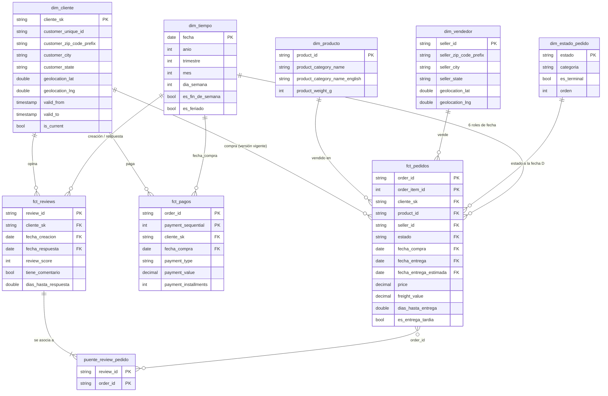

# Contratos de datos — Bronze / Silver / Gold

> Fase 1. Documento de diseño, cerrado antes de escribir código de
> transformación (principio rector #1 de `docs/decisions/plan-fases.md`).
> Decisiones de arquitectura no triviales referenciadas están en
> `docs/decisions/` (ADRs 0001-0004; stack y almacenamiento en 0005-0009;
> implementación física de Bronze en 0010-0015; diseño de Silver en
> 0017-0025; diseño de Gold en 0026-0036).

## Convenciones generales

- **Tipos**: se listan en términos conceptuales (`string`, `int`, `float`,
  `date`, `datetime`, `bool`); el tipo exacto de Polars/Pandera se fija al
  implementar (Fase 2/3).
- **Columnas de linaje** (todas las tablas Bronze): `dia_simulado` (date —
  partición), `ingested_at` (datetime — cuándo corrió la ingesta real),
  `source_file` (string), `batch_hash` (string — hash del contenido del
  batch, para detectar reprocesos idénticos).
- **Nomenclatura**: `bronze_<tabla>`, `silver_<tabla>`, `dim_*`/`fct_*` en
  Gold (según el plan).

---

## 1. Estrategia de replay cronológico (resumen)

Diseño completo en el ADR 0004. Resumen operativo:

| Tabla fuente | Ancla temporal | Re-emisión en Bronze |
| --- | --- | --- |
| `orders` | `order_purchase_timestamp`, `order_approved_at`, `order_delivered_carrier_date`, `order_delivered_customer_date` | Una fila cruda por cada timestamp no nulo, en el día simulado correspondiente |
| `order_reviews` | `review_creation_date` | Una fila, en su propio día |
| `order_items`, `order_payments` | (ninguno propio) | Una sola vez, junto al día de `order_purchase_timestamp` del pedido padre |
| `customers`, `products`, `sellers`, `geolocation`, `category_translation` | (sin dimensión temporal en la fuente) | Snapshot completo, no particionado por día |

`order_purchase_timestamp` es el ancla porque es el único timestamp de
`orders` sin nulos en el 100% de los pedidos (confirmado en la exploración
de Fase 0) — todo pedido tiene garantizado un "día de llegada" inicial.

---

## 2. Capa Bronze

### `bronze_orders`

Copia cruda de `orders.csv`, re-emitida por evento (ADR 0004).

| Columna | Tipo | Nullable | Notas |
| --- | --- | --- | --- |
| `order_id` | string | no | |
| `customer_id` | string | no | FK per-pedido, no es la persona real (ver `dim_cliente`) |
| `order_status` | string | no | valor final conocido del pedido, tal cual la fuente |
| `order_purchase_timestamp` | datetime | no | |
| `order_approved_at` | datetime | sí | nulo válido si el pedido no llegó a esa etapa |
| `order_delivered_carrier_date` | datetime | sí | ídem |
| `order_delivered_customer_date` | datetime | sí | ídem |
| `order_estimated_delivery_date` | datetime | no | |

**Grano:** `(order_id, dia_simulado)` — no `order_id` solo, porque un
mismo pedido puede re-emitirse en varios días.

### `bronze_order_items`

Copia cruda de `order_items.csv`. Grano: `(order_id, order_item_id)`.
Columnas: `order_id`, `order_item_id` (int), `product_id`, `seller_id`,
`shipping_limit_date` (datetime), `price` (float), `freight_value` (float)
— ninguna nullable.

### `bronze_order_payments`

Copia cruda de `order_payments.csv`. Grano: `(order_id, payment_sequential)`.
Columnas: `order_id`, `payment_sequential` (int), `payment_type` (string),
`payment_installments` (int), `payment_value` (float) — ninguna nullable.

### `bronze_order_reviews`

Copia cruda de `order_reviews.csv`. Grano `(review_id, order_id)`: un
mismo `review_id` puede aparecer asociado a varios pedidos (ADR 0021).
Columnas: `review_id`, `order_id`, `review_score` (int),
`review_comment_title` (string, nullable), `review_comment_message`
(string, nullable), `review_creation_date` (datetime),
`review_answer_timestamp` (datetime).

### Tablas de referencia (`bronze_customers`, `bronze_products`, `bronze_sellers`, `bronze_geolocation`, `bronze_category_translation`)

Copia cruda 1:1 de sus CSVs fuente, snapshot completo (sin partición por
día). Columnas = columnas originales del CSV (ver
`notebooks/01_exploracion_olist.ipynb`, sección 1, para el schema exacto
inferido de cada una).

### Implementación física de Bronze (Fase 2)

**Tipos:** todas las columnas fuente se persisten como texto; solo las
columnas de linaje van tipadas (ADR 0011). Los tipos listados arriba son
los que Silver debe poder convertir, no los físicos de Bronze.

**Layout** (relativo a la raíz de almacenamiento configurable, ADR 0008):

```text
bronze/
├── _staging/                      ← temporales de escritura (ADR 0015)
├── orders/dia_simulado=YYYY-MM-DD/part-0.parquet
├── order_items/dia_simulado=YYYY-MM-DD/part-0.parquet
├── order_payments/dia_simulado=YYYY-MM-DD/part-0.parquet
├── order_reviews/dia_simulado=YYYY-MM-DD/part-0.parquet
├── customers/snapshot.parquet
├── products/snapshot.parquet
├── sellers/snapshot.parquet
├── geolocation/snapshot.parquet
└── category_translation/snapshot.parquet
```

El nombre de la tabla en disco omite el prefijo `bronze_` (lo da la
carpeta de la capa). Particionado estilo Hive: Polars, DuckDB y dbt
reconstruyen `dia_simulado` a partir de la ruta, así que en las tablas de
eventos **no se guarda dentro del archivo**; en los snapshots sí va como
columna y significa "día en que se escribió el contenido actual" (ADR
0015). Un día sin datos para una tabla no genera partición vacía; si al
reprocesarlo existía una partición previa, se elimina (reemplazar por
"vacío", coherente con ADR 0012).

**Escritura atómica** (ADR 0015): cada archivo se escribe en `_staging/` y
se mueve a su destino con un reemplazo atómico de archivo. Solo
almacenamiento local en la Fase 2; una raíz remota falla explícitamente.

**Varios eventos el mismo día:** si dos o más timestamps ancla de un mismo
pedido caen el mismo `dia_simulado` (p. ej. compra y aprobación), se emite
**una sola fila** — el grano es `(order_id, dia_simulado)`. Medido sobre
Olist: 392,856 eventos no nulos colapsan en 308,454 filas de
`bronze_orders`, repartidas en 691 días (2016-09-04 → 2018-10-17).

**Idempotencia y `batch_hash`:** reemplazo atómico de la partición del día
(ADR 0012); `batch_hash` = SHA-256 del contenido canónico, usado también
para no reescribir snapshots sin cambios (ADR 0013). La serialización
canónica usa prefijo de longitud por valor (ADR 0014).

**Anomalías temporales de la fuente — Bronze no las corrige:** la regla de
re-emisión se aplica mecánicamente (ADR 0004), aunque produzca llegadas
"antes de tiempo":

- 166 pedidos tienen `order_delivered_carrier_date` con hora **anterior**
  a su `order_purchase_timestamp`. En 2 de ellos cae en un **día**
  anterior, y esos 2 aparecen en Bronze antes que su compra (y antes que
  sus `order_items`/`order_payments`). Corregido el 2026-09-25: antes decía
  que eran los 166.
- 64 reviews tienen `review_creation_date` anterior al día de compra de
  su pedido → la review llega a Bronze antes que el pedido.

Resuelto en la Fase 3: los pedidos adelantados se ubican en el día de su
compra por el ajuste del SCD2 (ADR 0019), y las reviews adelantadas
esperan a su pedido con un plazo de gracia (ADR 0020).

**Pedidos sin items ni pagos — válidos, no son huérfanos:** 775 pedidos no
tienen ninguna fila en `order_items` (603 `unavailable`, 164 `canceled`, 5
`created`, 2 `invoiced`, 1 `shipped`) y 1 pedido no tiene pagos. En el
replay aparecen como días con `orders` y pagos pero sin items. Las reglas
de FK de la sección 4 van solo de hijo a padre (un item sin pedido sí es
error); la dirección inversa (pedido sin hijos) es un estado válido y no
debe convertirse en regla de validación en la Fase 3.

**Los snapshots de referencia "conocen el futuro":** Olist no trae fechas
para `customers`, `products`, `sellers`, `geolocation` ni
`category_translation`, así que su snapshot completo existe desde el
primer día del replay (2016-09-04), incluidos clientes y productos que
recién aparecen en pedidos de 2018. No rompe ningún join, pero en Gold
(Fase 4) una pregunta del tipo "¿cuántos clientes había a la fecha X?" no
se puede responder contando `dim_customers`: hay que derivarla de los
pedidos (p. ej. la primera compra de cada cliente). Es una limitación
conocida de la simulación (consecuencia de ADR 0004), no un error.

**Corridas simultáneas del mismo día (pendiente para la Fase 5):** la
escritura es atómica por archivo (ADR 0015), pero si dos procesos ingieren
el mismo `dia_simulado` a la vez, cada tabla queda con la versión del
último en escribir y el día podría mezclar tablas de ambas corridas. Hoy
no ocurre (el replay es secuencial). En Airflow hay que impedir que dos
ejecuciones del mismo día corran en paralelo.

**Replay completo verificado (2026-09-24):** 774 días de calendario
(2016-09-04 → 2018-10-17; 691 con pedidos) en ~12 min. Cada tabla de
eventos coincide con su fuente por `batch_hash` (en `orders`, tras quitar
las re-emisiones), cada snapshot se escribió una sola vez, `_staging/`
quedó vacío; 2,581 archivos Parquet, 67.7 MB.

---

## 3. Capa Silver

Silver(D) es una **foto limpia de todo lo que se sabe al final del día D**:
se reconstruye completa en cada corrida a partir de Bronze hasta D (ADR
0017) y no incluye eventos que todavía no ocurrieron (ADR 0018). Aplica:
colapso de re-emisiones, resolución de tipos, enmascarado a la fecha D,
construcción del historial SCD2, normalización de catálogo (ADR 0003) y
validación fail-fast (sección 4).

### Convenciones de Silver

- **Tipos físicos:** identificadores y textos `String`; timestamps
  `Datetime` (microsegundos, sin zona horaria: hora local de la fuente);
  enteros `Int64`; montos `Decimal(18,2)` (ADR 0022); coordenadas
  `Float64`; códigos postales `String` de 5 dígitos (ADR 0021).
- **Tablas de hechos** (`orders`, `order_status_history`, `order_items`,
  `order_payments`, `order_reviews`): se enmascaran a la fecha D (ADR
  0018). **Tablas de referencia:** snapshots completos, sin enmascarar.
- **Sin columnas de linaje:** el linaje es por corrida, en
  `_manifest.json` (ADR 0024).
- **Filas:** cifras de Silver en el último día del replay (2018-10-17), que
  deben coincidir con la fuente (criterio de "hecho" de la Fase 3).

### `silver_orders`

Una fila por pedido: colapsa las re-emisiones de Bronze (el contenido es
idéntico entre ellas). **PK:** `order_id`. **FK:** `customer_id →
silver_customers`. **Filas:** 99,441.

| Columna | Tipo | Nullable | Notas |
| --- | --- | --- | --- |
| `order_id` | String | no | |
| `customer_id` | String | no | |
| `order_status` | String | no | estado **final** según la fuente, aunque D sea anterior (ADR 0018); el estado vigente a la fecha D está en el SCD2 |
| `order_purchase_timestamp` | Datetime | no | |
| `order_approved_at` | Datetime | sí | nulo si el evento no ocurrió o no ocurrió todavía a la fecha D |
| `order_delivered_carrier_date` | Datetime | sí | ídem |
| `order_delivered_customer_date` | Datetime | sí | ídem |
| `order_estimated_delivery_date` | Datetime | no | promesa conocida desde la compra: no se enmascara |

Un pedido existe en Silver(D) si su día de compra es `<= D`. Qué eventos
ocurrieron lo decide el `valid_from` ajustado del SCD2 (sección 5), para que
ambas tablas coincidan; el valor mostrado es el crudo.

### `silver_order_status_history` (SCD2)

Ver diseño completo en sección 5. **PK:** `(order_id, status_event)`.
**FK:** `order_id → silver_orders`. **Filas:** 392,856 (un evento por
timestamp no nulo).

### `silver_order_items`

**PK:** `(order_id, order_item_id)`. **FK:** `order_id → silver_orders`,
`product_id → silver_products`, `seller_id → silver_sellers`.
**Filas:** 112,650.

| Columna | Tipo | Nullable | Notas |
| --- | --- | --- | --- |
| `order_id` | String | no | |
| `order_item_id` | Int64 | no | posición del item en el pedido (1..21) |
| `product_id` | String | no | |
| `seller_id` | String | no | |
| `shipping_limit_date` | Datetime | no | plazo del vendedor, conocido desde la compra: no se enmascara |
| `price` | Decimal(18,2) | no | `>= 0` |
| `freight_value` | Decimal(18,2) | no | `>= 0` |

### `silver_order_payments`

**PK:** `(order_id, payment_sequential)`. **FK:** `order_id →
silver_orders`. **Filas:** 103,886.

| Columna | Tipo | Nullable | Notas |
| --- | --- | --- | --- |
| `order_id` | String | no | |
| `payment_sequential` | Int64 | no | |
| `payment_type` | String | no | incluye 3 pagos `not_defined` con monto 0, válidos |
| `payment_installments` | Int64 | no | `>= 0`: 2 pagos con 0 cuotas (ADR 0021) |
| `payment_value` | Decimal(18,2) | no | `>= 0` |

### `silver_order_reviews`

Una fila por vínculo review–pedido: la relación es de muchos a muchos (ADR
0021). **PK:** `(review_id, order_id)`. **FK:** `order_id → silver_orders`.
**Filas:** 99,224 (98,410 reviews distintas).

| Columna | Tipo | Nullable | Notas |
| --- | --- | --- | --- |
| `review_id` | String | no | |
| `order_id` | String | no | |
| `review_score` | Int64 | no | en `[1, 5]` |
| `review_comment_title` | String | sí | |
| `review_comment_message` | String | sí | |
| `review_creation_date` | Datetime | no | la review existe en Silver(D) si este día es `<= D` |
| `review_answer_timestamp` | Datetime | sí | nulo si la respuesta es posterior a D (en la fuente nunca es nulo) |

**Para contar reviews hay que usar `COUNT(DISTINCT review_id)`:** un
`COUNT(*)` suma 814 de más, porque una misma review puede estar asociada a
varios pedidos de la misma persona. Una review cuyo pedido todavía no llegó
no está en esta tabla sino en `_pendientes/` (ADR 0020).

### `silver_customers`

**PK:** `customer_id`. **Filas:** 99,441. Columnas: `customer_id`,
`customer_unique_id`, `customer_zip_code_prefix` (String, 5 dígitos),
`customer_city`, `customer_state` — ninguna nullable. Se conserva
`customer_unique_id` como columna, no como PK: la resolución a persona real
ocurre en Gold (`dim_cliente`).

### `silver_products`

Tipado + normalización de catálogo (ADR 0003). **PK:** `product_id`.
**Filas:** 32,951.

| Columna | Tipo | Nullable | Notas |
| --- | --- | --- | --- |
| `product_id` | String | no | |
| `product_category_name` | String | no | nulo en la fuente → `"sem_categoria"` (610 productos) |
| `product_category_name_english` | String | no | vía `silver_category_translation`; sin traducción → nombre en portugués (`pc_gamer`, `portateis_cozinha_e_preparadores_de_alimentos`) |
| `product_name_length` | Int64 | sí | renombrada desde `product_name_lenght` (errata de la fuente, ADR 0021) |
| `product_description_length` | Int64 | sí | renombrada desde `product_description_lenght` |
| `product_photos_qty` | Int64 | sí | |
| `product_weight_g` | Int64 | sí | |
| `product_length_cm` | Int64 | sí | |
| `product_height_cm` | Int64 | sí | |
| `product_width_cm` | Int64 | sí | |

Los nulos en las medidas son huecos de catálogo, no disparan fail-fast: los
610 productos sin categoría tampoco tienen nombre, descripción ni fotos, y
2 productos no tienen dimensiones.

### `silver_sellers`

**PK:** `seller_id`. **Filas:** 3,095. Columnas: `seller_id`,
`seller_zip_code_prefix` (String, 5 dígitos), `seller_city`,
`seller_state` — ninguna nullable.

### `silver_geolocation_agg`

Agregación de `bronze_geolocation` por `geolocation_zip_code_prefix`
(promedio de `lat`/`lng`) — la fuente no es 1:1 por código postal (1,000,163
filas para 19,015 códigos), así que no es utilizable como dimensión sin
agregar antes. Antes de promediar se descartan las filas con coordenadas
fuera de Brasil (ADR 0025): 42 filas en 21 códigos, y 5 códigos se quedan
sin ninguna fila válida. **PK:** `geolocation_zip_code_prefix`.
**Filas:** 19,010. Columnas: `geolocation_zip_code_prefix` (String),
`geolocation_lat` y `geolocation_lng` (Float64, ninguna nullable).

No es FK de clientes ni vendedores: 278 clientes y 7 vendedores tienen un
código postal sin geolocalización, y eso no es un error (es una tabla de
consulta). Los 5 códigos descartados se suman a ese mismo caso.

### `silver_category_translation`

Igual a `bronze_category_translation`, sin cambios. **PK:**
`product_category_name`. **Filas:** 71.

### Implementación física de Silver (Fase 3)

**Layout** (relativo a la raíz de almacenamiento configurable, ADR 0008),
sin partición (ADR 0024):

```text
silver/
├── _staging/                          ← temporales de escritura
├── _manifest.json                     ← se escribe al final de cada corrida
├── _pendientes/order_reviews.parquet  ← reviews esperando su pedido (ADR 0020)
├── orders/part-0.parquet
├── order_status_history/part-0.parquet
├── order_items/part-0.parquet
├── order_payments/part-0.parquet
├── order_reviews/part-0.parquet
├── customers/part-0.parquet
├── products/part-0.parquet
├── sellers/part-0.parquet
├── geolocation_agg/part-0.parquet
└── category_translation/part-0.parquet
```

**Orden de escritura** (ADR 0024): construir y validar todo en memoria →
borrar `_manifest.json` → escribir cada archivo de forma atómica (staging +
`os.replace`, mismo mecanismo que Bronze, ADR 0015) → escribir
`_manifest.json`. Si falta el manifiesto, o su `as_of` no es el esperado,
Silver está incompleto y no se debe leer.

**Manifiesto:** `as_of` (fecha D), `built_at`, rango y cantidad de días de
Bronze leídos, filas por tabla y cantidad de reviews pendientes.

**Reviews pendientes** (ADR 0020): mismas columnas que
`silver_order_reviews` más `dias_pendiente`. Plazo de gracia configurable
en `config/pipeline.yaml` (120 días); en el último día del replay el
archivo debe estar vacío.

**Corrida real verificada (2026-09-25):** `uv run silver-build --dia
2018-10-17` sobre el Bronze completo tarda ~1.8 s y escribe 31 MB. Leyó 710
días de Bronze (los días con alguna partición, incluidos los que solo
tienen reviews). Todas las tablas coinciden con la fuente: 99,441 pedidos,
392,856 eventos de estado, 112,650 items, 103,886 pagos, 99,224 reviews,
99,441 clientes, 32,951 productos, 3,095 vendedores, 19,010 códigos
postales y 71 categorías, con 0 reviews pendientes y 0 fallas de
validación. Reconstruir el mismo día, aun con otro día construido en el
medio, deja los 11 Parquet idénticos byte a byte. DuckDB los lee con los
tipos del contrato (`DECIMAL(18,2)`, `TIMESTAMP`, `BOOLEAN`), y la suma de
pagos da 16,008,872.12 exacto. En días intermedios, 0 eventos posteriores
a D; el 2018-08-04, por ejemplo, hay 21 reviews pendientes (la más antigua,
con 91 días).

---

## 4. Reglas de calidad no negociables (fail-fast) por transición

Semántica: hard-stop total del batch (ADR 0001), alcance definido en
ADR 0003. Estas son las reglas concretas a implementar — no hay ambigüedad
pendiente. Bronze→Silver se implementa como schemas Pandera más chequeos
entre tablas (Fase 3); Silver→Gold, como tests de dbt (Fase 4, ADR 0007).
Cambia la herramienta según la transición, no la regla.

### Bronze → Silver (dispara fail-fast)

Todas las fallas de una corrida se reportan juntas en una sola
`SilverValidationError` y no se escribe nada (ADR 0023).

- Nulo en cualquier columna marcada "no" en las tablas de la sección 3
  (ej. `order_id`, `customer_id`, `product_id`, `order_status`,
  `price`, `freight_value`, `payment_value`).
- Violación de PK (sección 3). La única deduplicación es el colapso de las
  re-emisiones de `orders`; en reviews la PK es `(review_id, order_id)`
  (ADR 0021).
- Huérfano de FK — hoy 0 casos en: `order_items→orders`,
  `order_items→products`, `order_items→sellers`, `order_payments→orders`,
  `orders→customers`. En `order_reviews→orders`, una review cuyo pedido
  todavía no llegó queda pendiente hasta 120 días; si el plazo vence, es
  un huérfano real (ADR 0020). Si aparece un huérfano, es una regresión de
  la fuente y debe frenar el pipeline.
- Tipo no parseable: un timestamp fuera del formato
  `YYYY-MM-DD HH:MM:SS` en una columna no documentada como "nulo válido";
  un entero que no convierte; un monto que no cumple
  `^-?\d+(\.\d{1,2})?$` (más de 2 decimales se truncaría en silencio, ADR
  0022); un código postal que no cumple `^\d{5}$` (ADR 0021).
- Medida imposible: `price < 0`, `freight_value < 0`, `payment_value < 0`,
  `payment_installments < 0` (ADR 0021), `review_score` fuera de `[1, 5]`.

### Bronze → Silver (NO dispara fail-fast — se normaliza)

- `product_category_name` nulo → normalizado a `"sem_categoria"`.
- Categoría sin fila en `category_translation` → fallback al nombre en
  portugués.
- Timestamps de `orders` nulos cuando el `order_status` explica el nulo
  (ej. pedido no entregado sin `order_delivered_customer_date`).
- Timestamps de `orders` fuera del orden de etapa → `valid_from` ajustado
  en el SCD2, conservando el crudo (ADR 0019).
- Review cuyo pedido todavía no llegó, dentro del plazo de gracia →
  pendiente (ADR 0020).
- Medidas nulas en `products` (huecos de catálogo, sección 3).
- Coordenadas de geolocalización fuera de Brasil → se descartan antes de
  promediar (ADR 0025).

### Silver → Gold (dispara fail-fast)

Se implementan como tests de dbt con severidad `error`; un test que falla
hace fallar `gold-build` y Gold no se publica (ADRs 0007, 0028, 0036).

- Cualquier fila de un fact (`fct_pedidos`, `fct_pagos`, `fct_reviews`,
  `puente_review_pedido`) que no resuelva **todas** sus FKs contra las
  dimensiones correspondientes, incluidas las fechas role-playing contra
  `dim_tiempo` — debería ser imposible dado que Silver ya garantiza
  integridad referencial, pero se revalida como red de seguridad en el
  borde Silver→Gold.
- Grano duplicado en un fact (ej. dos filas para el mismo
  `(order_id, order_item_id)` en `fct_pedidos`).
- Medida imposible que haya sobrevivido agregaciones (mismos rangos que
  en Bronze→Silver).
- SCD2 de `dim_cliente` inconsistente: rangos que se solapan, más de una
  versión vigente por persona, o un hecho que apunta a una versión no
  vigente a su fecha (ADR 0030).
- Columnas o tipos de un mart distintos de su contrato (ADR 0036).

---

## 5. Diseño SCD2 — `silver_order_status_history`

**Objetivo:** reconstruir la trayectoria de estados de un pedido a partir
de sus timestamps (ADR 0004), sin que Olist provea un log de cambios
explícito, y poder responder "¿en qué estado estaba el pedido en el
instante X?".

**Construcción** (ADR 0019): cada uno de los 4 timestamps no nulos de un
pedido genera una fila de evento. Las filas se ordenan por **etapa**, no por
hora:

| Etapa | `status_event` | Timestamp fuente |
| --- | --- | --- |
| 1 | `creado` | `order_purchase_timestamp` |
| 2 | `aprobado` | `order_approved_at` |
| 3 | `despachado` | `order_delivered_carrier_date` |
| 4 | `entregado` | `order_delivered_customer_date` |

- Un timestamp nulo no genera fila (un pedido cancelado antes de aprobarse
  tiene solo `creado`; 14 pedidos pasan de `creado` a `despachado` sin
  `aprobado`).
- `valid_from` = el máximo entre el timestamp crudo del evento y el
  `valid_from` del evento anterior del pedido: nunca retrocede. Corrige a
  los 1,382 pedidos (1.4%) cuyas horas están fuera del orden de etapa.
- `valid_to` = `valid_from` del siguiente evento visible del pedido; nulo en
  el último. Intervalos semiabiertos `[valid_from, valid_to)`: en cada
  instante hay exactamente un estado vigente.
- A la fecha D solo son visibles los eventos cuyo `valid_from` cae en un día
  `<= D` (ADR 0018).

**Schema de `silver_order_status_history`:**

| Columna | Tipo | Nullable | Notas |
| --- | --- | --- | --- |
| `order_id` | String | no | FK a `silver_orders` |
| `status_event` | String | no | uno de `creado / aprobado / despachado / entregado` |
| `order_status_raw` | String | no | el `order_status` final tal cual la fuente (contexto) |
| `event_timestamp` | Datetime | no | timestamp crudo del evento |
| `valid_from` | Datetime | no | inicio del intervalo, ajustado para no retroceder |
| `valid_to` | Datetime | sí | `valid_from` del siguiente evento visible; nulo si es el vigente |
| `is_current` | Boolean | no | `true` solo en la fila con `valid_to` nulo |
| `is_adjusted` | Boolean | no | `true` si `valid_from` difiere de `event_timestamp` |

**PK:** `(order_id, status_event)`. Máximo 4 filas por pedido.

**Ejemplo con ajuste** (pedido `000576fe…`, despachado antes de aprobarse):

| `status_event` | `event_timestamp` | `valid_from` | `valid_to` | `is_adjusted` |
| --- | --- | --- | --- | --- |
| creado | 07-04 12:08:27 | 07-04 12:08:27 | 07-05 16:35:48 | false |
| aprobado | 07-05 16:35:48 | 07-05 16:35:48 | 07-05 16:35:48 | false |
| despachado | 07-05 12:15:00 | 07-05 16:35:48 | 07-09 14:04:07 | true |
| entregado | 07-09 14:04:07 | 07-09 14:04:07 | null | false |

"aprobado" queda con duración cero: el pedido pasó por esa etapa, pero
ninguna consulta "en el instante X" lo encuentra en ella (ADR 0019).

**Medido sobre el replay completo (2026-09-25):** 392,856 eventos; 1,443
filas ajustadas en 1,382 pedidos; 0 intervalos negativos; exactamente una
fila vigente por pedido. Hay 2,748 intervalos de duración cero: 1,443 por
el ajuste y 1,305 porque la fuente trae dos eventos con la misma hora (1,296
pedidos aprobados en el mismo segundo de la compra, 9 entregados en el
mismo segundo del despacho).

Esta tabla es la que responde "¿cuál era el estado de este pedido en la
fecha X?" — no se modela como fact en Gold; Gold consume el estado
**actual** (`is_current = true`) a través de `dim_estado_pedido`. El
historial completo queda disponible en Silver para quien lo necesite
consultar directamente.

**Resuelto en la Fase 4 (ADR 0031):** el SCD2 no representa estados sin
timestamp (`canceled`, `unavailable`). Gold combina ambas fuentes: la
cancelación y la no disponibilidad salen de `order_status` y ganan
siempre; el resto de la progresión sale de la fila vigente del SCD2.

---

## 6. Capa Gold — modelo dimensional (star schema)

Gold(D) es el modelo dimensional construido por dbt sobre Silver(D) y
publicado de forma atómica en `gold/warehouse.duckdb` (ADRs 0026-0036).
Reemplaza al contrato de Gold de la Fase 1: `dim_cliente` pasó a ser SCD2,
`dim_estado_pedido` tiene 6 estados, `dim_tiempo` cubre un calendario
fijo, `fct_pedidos` es un accumulating snapshot y se agregaron
`fct_reviews` y `puente_review_pedido`.

### Convenciones de Gold

- **Tipos físicos** (DuckDB): identificadores y textos `VARCHAR`; fechas
  `DATE`; instantes `TIMESTAMP`; montos `DECIMAL(18,2)` (ADR 0022);
  enteros `BIGINT`; días con fracción y coordenadas `DOUBLE`; indicadores
  `BOOLEAN`. Los marts tienen contrato de dbt aplicado: el build falla si
  una columna o su tipo difiere de lo documentado aquí (ADR 0036).
- **Nombres:** las columnas que vienen de la fuente conservan su nombre
  (`price`, `review_score`); las derivadas en Gold van en español
  (`cliente_sk`, `dias_hasta_entrega`). Los valores categóricos de Gold van
  en español (`cancelado`, `lunes`).
- **Claves:** `dim_cliente` usa la clave sustituta `cliente_sk` (hash, ADR
  0030); el resto de las dimensiones, su clave natural. Las fechas de los
  hechos son FKs `DATE` a `dim_tiempo`, cada una con su rol.
- **Materialización** (ADR 0029): dimensiones como tabla completa; hechos
  incrementales. `_visible_desde` es la marca de agua técnica de cada
  hecho: el instante desde el cual su contenido actual es visible en
  Silver. No es una medida.
- **Capas internas:** staging e intermediate son vistas en sus propios
  esquemas y leen el Silver actual; no son parte del contrato (ADR 0026).
- **Filas:** los hechos deben coincidir con Silver en el último día del
  replay (criterio de "hecho" de la Fase 4).

### Dimensiones

**`dim_cliente`** (SCD2, ADR 0030) — grano: **una versión de dirección de
una persona** (`customer_unique_id`). Se construye con los pedidos visibles
en Silver(D), no con `silver_customers` sola (que conoce el futuro). Una
versión nueva cada vez que la dirección difiere de la del pedido anterior;
volver a una dirección vieja es una versión nueva. **PK:** `cliente_sk`.
**Clave natural:** `(customer_unique_id, valid_from)`. **Filas:** una por
persona (96,096 en el último día) más las versiones adicionales de las 252
personas con más de una dirección.

| Columna | Tipo | Nullable | Notas |
| --- | --- | --- | --- |
| `cliente_sk` | VARCHAR | no | `generate_surrogate_key(customer_unique_id, valid_from)`: estable ante reconstrucciones |
| `customer_unique_id` | VARCHAR | no | la persona |
| `customer_zip_code_prefix` | VARCHAR | no | 5 dígitos |
| `customer_city` | VARCHAR | no | |
| `customer_state` | VARCHAR | no | |
| `geolocation_lat` | DOUBLE | sí | por código postal de la versión; nula si no hay geolocalización (ADR 0035) |
| `geolocation_lng` | DOUBLE | sí | ídem |
| `valid_from` | TIMESTAMP | no | compra del primer pedido de la versión |
| `valid_to` | TIMESTAMP | sí | `valid_from` de la versión siguiente; nulo en la vigente |
| `is_current` | BOOLEAN | no | una sola versión vigente por persona |

Intervalos semiabiertos `[valid_from, valid_to)`, como el SCD2 de Silver.

**`dim_producto`** — grano: `product_id`. **Filas:** 32,951. Todas las
columnas de `silver_products` con sus mismos tipos y nulos:
`product_id` (PK), `product_category_name`,
`product_category_name_english`, `product_name_length`,
`product_description_length`, `product_photos_qty`, `product_weight_g`,
`product_length_cm`, `product_height_cm`, `product_width_cm`.

**`dim_vendedor`** — grano: `seller_id`. **Filas:** 3,095.

| Columna | Tipo | Nullable | Notas |
| --- | --- | --- | --- |
| `seller_id` | VARCHAR | no | PK |
| `seller_zip_code_prefix` | VARCHAR | no | 5 dígitos |
| `seller_city` | VARCHAR | no | |
| `seller_state` | VARCHAR | no | |
| `geolocation_lat` | DOUBLE | sí | nula en 7 vendedores (ADR 0035) |
| `geolocation_lng` | DOUBLE | sí | ídem |

`dim_producto` y `dim_vendedor` salen de tablas de referencia sin
enmascarar: a cualquier D contienen también productos y vendedores que
todavía no vendieron (limitación ya documentada, "los snapshots conocen el
futuro").

**`dim_tiempo`** (ADR 0032) — grano: un día calendario, rango fijo
2016-01-01 a 2020-12-31 (`vars` de `dbt_project.yml`). **PK:** `fecha`.
**Filas:** 1,827.

| Columna | Tipo | Nullable | Notas |
| --- | --- | --- | --- |
| `fecha` | DATE | no | PK |
| `anio` | BIGINT | no | |
| `trimestre` | BIGINT | no | 1-4 |
| `mes` | BIGINT | no | 1-12 |
| `nombre_mes` | VARCHAR | no | `enero` … `diciembre` (mapeo explícito, no depende del *locale*) |
| `dia` | BIGINT | no | día del mes |
| `dia_semana` | BIGINT | no | ISO: 1 = lunes … 7 = domingo |
| `nombre_dia` | VARCHAR | no | `lunes` … `domingo` |
| `semana_iso` | BIGINT | no | |
| `anio_mes` | VARCHAR | no | `AAAA-MM` |
| `es_fin_de_semana` | BOOLEAN | no | |
| `es_feriado` | BOOLEAN | no | feriado nacional de Brasil (seed generado con `holidays`) |
| `nombre_feriado` | VARCHAR | sí | nulo si no es feriado |

**`dim_estado_pedido`** (ADR 0031, seed de dbt) — grano: estado. **PK:**
`estado`. **Filas:** 6.

| `estado` | `categoria` | `es_terminal` | `orden` |
| --- | --- | --- | --- |
| `creado` | `en_curso` | false | 1 |
| `aprobado` | `en_curso` | false | 2 |
| `despachado` | `en_curso` | false | 3 |
| `entregado` | `completado` | true | 4 |
| `cancelado` | `cancelado` | true | 5 |
| `no_disponible` | `cancelado` | true | 6 |

Más `descripcion` (VARCHAR). Tipos: `estado`, `categoria` VARCHAR;
`es_terminal` BOOLEAN; `orden` BIGINT.

### Hechos

**`fct_pedidos`** (accumulating snapshot, ADR 0033) — grano: línea de
pedido. **PK:** `(order_id, order_item_id)`. Incremental con merge por la
PK (ADR 0029). **Filas:** 112,650 en el último día.

| Columna | Tipo | Nullable | Notas |
| --- | --- | --- | --- |
| `order_id` | VARCHAR | no | dimensión degenerada |
| `order_item_id` | BIGINT | no | |
| `cliente_sk` | VARCHAR | no | FK `dim_cliente`: la versión de la compra, resuelta por `customer_id` |
| `product_id` | VARCHAR | no | FK `dim_producto` |
| `seller_id` | VARCHAR | no | FK `dim_vendedor` |
| `estado` | VARCHAR | no | FK `dim_estado_pedido`: estado del pedido a la fecha D (ADR 0031) |
| `fecha_compra` | DATE | no | FK `dim_tiempo` |
| `fecha_aprobacion` | DATE | sí | FK `dim_tiempo`; nula si no ocurrió a la fecha D |
| `fecha_despacho` | DATE | sí | ídem |
| `fecha_entrega` | DATE | sí | ídem |
| `fecha_entrega_estimada` | DATE | no | FK `dim_tiempo`; promesa, puede ser futura |
| `fecha_limite_envio` | DATE | no | FK `dim_tiempo`; `shipping_limit_date`, puede ser futura (máx. 2020-04-09) |
| `price` | DECIMAL(18,2) | no | aditiva por línea |
| `freight_value` | DECIMAL(18,2) | no | aditiva por línea |
| `dias_hasta_aprobacion` | DOUBLE | sí | de la compra a la aprobación, en días con fracción |
| `dias_hasta_entrega` | DOUBLE | sí | de la compra a la entrega al cliente |
| `dias_retraso` | DOUBLE | sí | entrega real − estimada; negativo si llegó antes |
| `es_entrega_tardia` | BOOLEAN | sí | entrega real posterior a la estimada; nulo si no se entregó |
| `_visible_desde` | TIMESTAMP | no | `valid_from` del último evento visible del pedido |

Las fechas y medidas de proceso son del **pedido** y se repiten en cada
línea: los KPIs por pedido se calculan sobre pedidos distintos
(`COUNT(DISTINCT order_id)` o agregando primero por pedido). Medido en el
diseño, por pedido entregado: 12.5 días promedio hasta la entrega y 8.1%
de entregas tardías. Un pedido cancelado figura `cancelado` desde su
compra (fuga aceptada, ADR 0018).

**`fct_pagos`** — grano: `(order_id, payment_sequential)`. Incremental en
modo append. **Filas:** 103,886.

| Columna | Tipo | Nullable | Notas |
| --- | --- | --- | --- |
| `order_id` | VARCHAR | no | dimensión degenerada |
| `payment_sequential` | BIGINT | no | |
| `cliente_sk` | VARCHAR | no | FK `dim_cliente`, vía el pedido |
| `fecha_compra` | DATE | no | FK `dim_tiempo` |
| `payment_type` | VARCHAR | no | atributo degenerado (baja cardinalidad) |
| `payment_installments` | BIGINT | no | `>= 0` |
| `payment_value` | DECIMAL(18,2) | no | `>= 0`; la suma debe dar 16,008,872.12 en el último día |
| `_visible_desde` | TIMESTAMP | no | compra del pedido |

**`fct_reviews`** (ADR 0034) — grano: `review_id`. Incremental con merge
por `review_id`. **Filas:** 98,410. `COUNT(*)` y `AVG(review_score)` son
correctos sin `DISTINCT` (promedio 4.0888).

| Columna | Tipo | Nullable | Notas |
| --- | --- | --- | --- |
| `review_id` | VARCHAR | no | PK |
| `cliente_sk` | VARCHAR | no | FK `dim_cliente`: versión vigente a la creación; si la review es anterior a la primera versión (review adelantada, ADR 0020), la primera |
| `fecha_creacion` | DATE | no | FK `dim_tiempo` |
| `fecha_respuesta` | DATE | sí | FK `dim_tiempo`; nula si la respuesta es posterior a D |
| `review_score` | BIGINT | no | en `[1, 5]` |
| `tiene_comentario` | BOOLEAN | no | hay `review_comment_message` no vacío; el título solo no cuenta |
| `dias_hasta_respuesta` | DOUBLE | sí | de la creación a la respuesta |
| `_visible_desde` | TIMESTAMP | no | el mayor entre la creación, la compra de su primer pedido visible y la respuesta |

**`puente_review_pedido`** (ADR 0034) — grano: `(review_id, order_id)`.
Incremental con merge por la PK. **Filas:** 99,224.

| Columna | Tipo | Nullable | Notas |
| --- | --- | --- | --- |
| `review_id` | VARCHAR | no | FK `fct_reviews` |
| `order_id` | VARCHAR | no | pedido de `fct_pedidos` |
| `_visible_desde` | TIMESTAMP | no | el mayor entre la creación de la review y la compra de ese pedido |

Cruzar reviews con productos o vendedores pasa por el puente y
`fct_pedidos`: una review cuenta en cada línea a la que llega, así que esos
cruces exigen decidir cómo ponderar.

### Metadatos de la corrida

**`_gold_build`** (ADR 0028) — una fila, la de la última publicación:
`as_of` (DATE, la fecha D), `built_at` (TIMESTAMP), `silver_built_at`
(TIMESTAMP, del manifiesto de Silver usado), `full_refresh` (BOOLEAN) y las
filas por mart. Responde con SQL a qué día corresponde Gold.

### Implementación física de Gold (Fase 4)

```text
gold/
├── _staging/          ← temporal de la corrida en curso (ADR 0028)
└── warehouse.duckdb   ← se reemplaza entero al final de cada corrida exitosa
```

`uv run gold-build --dia AAAA-MM-DD [--full-refresh]` (ADR 0027): verifica
el manifiesto de Silver (`as_of == D`) y que Gold no esté en un día
posterior (salvo `--full-refresh`); copia `warehouse.duckdb` a
`_staging/`; corre `dbt build` contra la copia; escribe `_gold_build`,
hace `CHECKPOINT` y reemplaza el archivo con `os.replace`. Si algo falla,
`warehouse.duckdb` queda como estaba.

### Diagrama ER


```mermaid
erDiagram
    dim_cliente ||--o{ fct_pedidos : "compra (versión vigente)"
    dim_cliente ||--o{ fct_pagos : "paga"
    dim_cliente ||--o{ fct_reviews : "opina"
    dim_producto ||--o{ fct_pedidos : "vendido en"
    dim_vendedor ||--o{ fct_pedidos : "vende"
    dim_estado_pedido ||--o{ fct_pedidos : "estado a la fecha D"
    dim_tiempo ||--o{ fct_pedidos : "6 roles de fecha"
    dim_tiempo ||--o{ fct_pagos : "fecha_compra"
    dim_tiempo ||--o{ fct_reviews : "creación / respuesta"
    fct_reviews ||--|{ puente_review_pedido : "se asocia a"
    fct_pedidos }o--o{ puente_review_pedido : "order_id"

    dim_cliente {
        string cliente_sk PK
        string customer_unique_id
        string customer_zip_code_prefix
        string customer_city
        string customer_state
        double geolocation_lat
        double geolocation_lng
        timestamp valid_from
        timestamp valid_to
        bool is_current
    }
    dim_producto {
        string product_id PK
        string product_category_name
        string product_category_name_english
        int product_weight_g
    }
    dim_vendedor {
        string seller_id PK
        string seller_zip_code_prefix
        string seller_city
        string seller_state
        double geolocation_lat
        double geolocation_lng
    }
    dim_tiempo {
        date fecha PK
        int anio
        int trimestre
        int mes
        int dia_semana
        bool es_fin_de_semana
        bool es_feriado
    }
    dim_estado_pedido {
        string estado PK
        string categoria
        bool es_terminal
        int orden
    }
    fct_pedidos {
        string order_id PK
        int order_item_id PK
        string cliente_sk FK
        string product_id FK
        string seller_id FK
        string estado FK
        date fecha_compra FK
        date fecha_entrega FK
        date fecha_entrega_estimada FK
        decimal price
        decimal freight_value
        double dias_hasta_entrega
        bool es_entrega_tardia
    }
    fct_pagos {
        string order_id PK
        int payment_sequential PK
        string cliente_sk FK
        date fecha_compra FK
        string payment_type
        decimal payment_value
        int payment_installments
    }
    fct_reviews {
        string review_id PK
        string cliente_sk FK
        date fecha_creacion FK
        date fecha_respuesta FK
        int review_score
        bool tiene_comentario
        double dias_hasta_respuesta
    }
    puente_review_pedido {
        string review_id PK
        string order_id PK
    }
```
